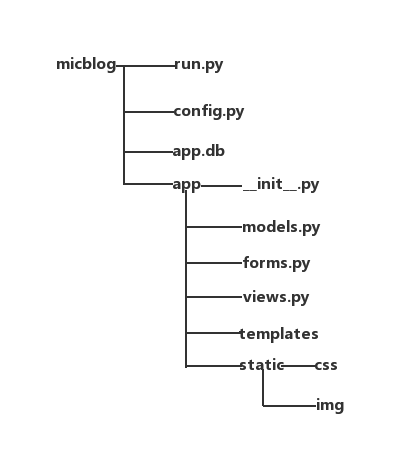

# MiniBlog
<h2>1.运行环境</h2>
	<ul>
		<li>Windows 7</li>
		<li>Python 2.7</li>
		<li>Flask</li>
		<li>Opera</li>
	</ul>
	<h2>2.安装包</h2>
	<h3 style="color: red;"><--pip真是个好东西--></h3>
	<ul>
		<li>flask</li>
		<li>flask-login</li>
		<li>flask-mail</li>
		<li>flask-sqlalchemy</li>
		<li>sqlalchemy-migrate</li>
		<li>flask-whooshalchemy</li>
		<li>flask-wtf</li>
		<li>flask-babel</li>
		<li>guess_language</li>
		<li>flipflop</li>
		<li>coverage</li>
		<li>flask-bootstrap</li>
	</ul>
	<h2>3.文件目录</h2>
	
	<h2>4.运行</h2>
	<ul>
		<li>python run.py</li>
	<li>管理员账号：admin@163.com；密码：111111</li>
		<li>会员：luxiaofeng@163.com；密码：111111</li>
	</ul>
